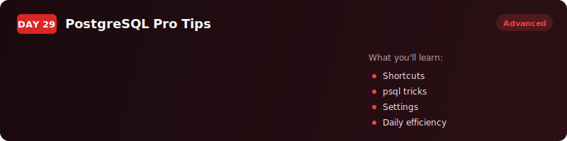
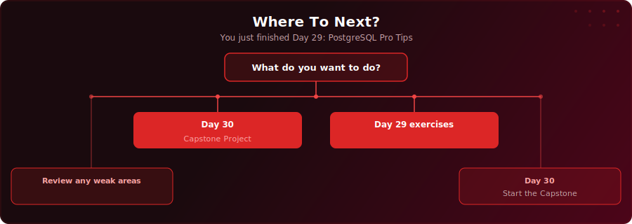

  

  
  
  

# Day 29 - PostgreSQL Pro Tips

[<< Day 28: EXPLAIN & Indexing](../day-28/) | [Day 30: Capstone: FinTech Lending Analytics >>](../day-30/)

---

## What You'll Learn

- 10 PostgreSQL shortcuts that replace verbose multi-step workarounds with cleaner, faster alternatives
- DISTINCT ON for first-row-per-group problems without window functions
- FILTER for conditional aggregation without CASE WHEN
- RETURNING, generate_series(), LATERAL joins, string_agg(), TABLESAMPLE, dollar-quoting, EXCLUDED, and partial indexes

---

## Where To Next?

  

---

  <a href="../day-28/">&#9664; Day 28: EXPLAIN & Indexing</a> &nbsp;&nbsp;|&nbsp;&nbsp; <a href="../day-30/">Day 30: Capstone: FinTech Lending Analytics &#9654;</a>

