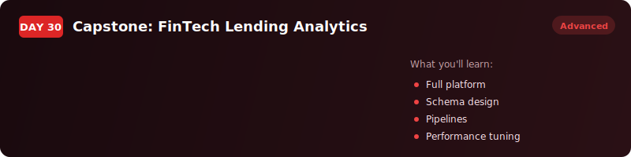
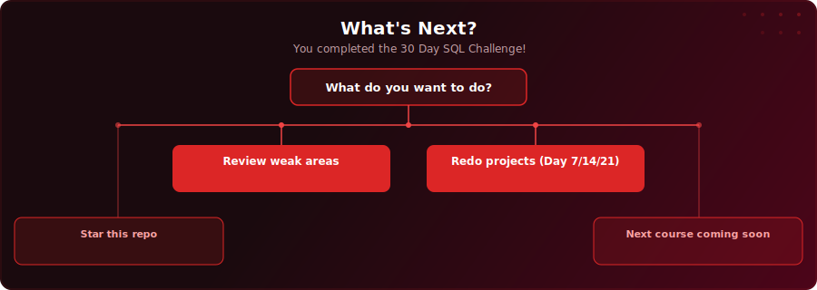

  

  
  
  

# Day 30 - Capstone: FinTech Lending Analytics

[<< Day 29: PostgreSQL Pro Tips](../day-29/) | Challenge complete!

---

## What You'll Learn

- How to combine everything from the past 29 days into a single production-grade analytics platform
- Schema design with star schema thinking, data pipelines with CTEs and MERGE, business logic with UDFs
- Borrower segmentation with window functions, performance tuning with EXPLAIN ANALYSE and indexes
- Self-documenting infrastructure with materialised views and column comments

---

---

  

## Where To Next?

  

---

  <a href="../day-29/">&#9664; Day 29: PostgreSQL Pro Tips</a>

---

<!-- CLIFFHANGER -->

<b>YOU DID IT</b>

<b>All 30 days.</b> That's the challenge done.

<i>Now build something with it.</i>

<a href="../README.md">&larr; Back to the curriculum</a>

<!-- /CLIFFHANGER -->
