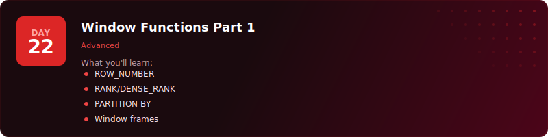

<p align="center">
  <a href="../README.md"></a>
</p>

<p align="center">
  <a href="../README.md"></a>
  <a href="why-this-challenge.md"></a>
</p>

# Where Should I Start?

Not everyone is starting from zero - and the challenge is designed for that. Whether you've never seen a SELECT statement or you're a data engineer who wants to sharpen your window functions, there's a starting point that makes sense for you.

Pick the one that sounds like you.

---

## "I've never written SQL before"

<p align="center">
  <a href="../day-01/"></a>
</p>

**Start at [Day 1](../day-01/).**

You'll install PostgreSQL and pgAdmin, create your first database, and write your first query. No prior knowledge needed - we start from literally nothing.

**What you'll cover in Week 1 (Days 1-7):**
- How databases store data in tables, rows, and columns
- How to pull data with SELECT and filter with WHERE
- Sorting, limiting, grouping, and aggregating
- Adding, changing, and deleting data
- How tables connect through keys and constraints
- A full project pulling everything together

**Why start here:** If you skip the fundamentals, everything after Day 7 builds on shaky ground. Week 1 is quick - most people finish each day in 20-30 minutes. It's worth doing even if some of it feels basic, because the exercises are where the real learning happens.

**You'll be ready for Week 2 by:** Day 8, about a week in.

---

## "I know the basics but it's been a while"

<p align="center">
  <a href="../day-08/"></a>
</p>

**Start at [Day 8](../day-08/).**

You can write a SELECT and you know what WHERE does, but the intermediate stuff - NULLs, string functions, CASE WHEN, subqueries - is either rusty or you never properly learnt it.

**What you'll cover in Week 2 (Days 8-14):**
- NULL handling (the thing that breaks most queries silently)
- String and numeric functions for cleaning messy data
- Date functions, intervals, and type casting
- CASE WHEN for conditional logic inside queries
- Subqueries and temp tables for multi-step problems
- CTEs - the cleaner alternative to nested subqueries
- A full project using everything above

**Why start here:** This is the stuff that separates "I know some SQL" from "I'm comfortable with SQL." Most people in data jobs use these functions daily but learnt them haphazardly. Week 2 gives you proper foundations for the patterns you'll use most.

**If you get stuck:** Drop back to the specific Day 1-7 topic you need. Each day's README has a "Where To Next?" section that points you to the right refresher.

---

## "I can query but I've never properly learnt JOINs"

<p align="center">
  <a href="../day-15/"></a>
</p>

**Start at [Day 15](../day-15/).**

You can write single-table queries confidently, but the moment someone says "join these two tables" you're guessing. Or you always use LEFT JOIN because it "seems to work" without understanding what it actually does.

**What you'll cover in Week 3 (Days 15-21):**
- INNER, LEFT, RIGHT, and FULL OUTER JOINs - what each keeps and drops
- CROSS JOINs and Self JOINs for combinations and comparisons
- UNION for stacking result sets
- Normalisation - why databases split data across tables in the first place
- Recursive CTEs for hierarchical data (org charts, category trees)
- Star schema design - how analytics teams actually model data
- A full SaaS conversion analysis project

**Why start here:** JOINs are the single most important skill that separates beginners from job-ready candidates. Every real database has multiple tables. If you can't connect them confidently, you can't answer real business questions. This week fixes that.

**Prerequisites:** You should be comfortable with SELECT, WHERE, GROUP BY, and basic functions. If CASE WHEN or subqueries feel unfamiliar, do Days 11-13 first.

---

## "I already use SQL at work - give me the advanced stuff"

<p align="center">
  <a href="../day-22/"></a>
</p>

**Start at [Day 22](../day-22/).**

You write SQL daily. You can JOIN tables, write CTEs, handle NULLs. But window functions still confuse you, you've never used MERGE, and you don't know how to read a query plan. This is where you level up.

**What you'll cover in Week 4 (Days 22-30):**
- Window functions: ROW_NUMBER, RANK, DENSE_RANK, LAG, LEAD
- Slowly Changing Dimensions and MERGE (upsert in one statement)
- Views and materialised views for reusable query objects
- Information schema - querying the database about itself
- User-defined functions for reusable logic
- EXPLAIN ANALYSE and indexing for performance
- PostgreSQL-specific pro tips
- A full capstone: FinTech lending analytics platform (6 tables, 14,000+ rows)

**Why start here:** This is production-grade SQL. The stuff that gets you promoted from "writes queries" to "designs systems." Window functions alone are a game-changer - once you learn them, you'll wonder how you ever worked without them.

**Prerequisites:** Comfortable with JOINs, CTEs, subqueries, and GROUP BY. If any of those feel shaky, do the relevant days first - each one is self-contained.

---

## Still not sure?

Here's a quick test. Try this query in your head:

```sql
SELECT department, COUNT(*), AVG(salary)
FROM employees
WHERE hire_date >= '2024-01-01'
GROUP BY department
HAVING AVG(salary) > 50000
ORDER BY COUNT(*) DESC;
```

- **Can't parse it at all?** Start at [Day 1](../day-01/).
- **Understand it but couldn't write it from scratch?** Start at [Day 8](../day-08/).
- **Could write it easily but not sure how to JOIN another table into it?** Start at [Day 15](../day-15/).
- **Could do all of that but don't know what `ROW_NUMBER() OVER (PARTITION BY ...)` means?** Start at [Day 22](../day-22/).

---

## Every day connects to the next

No matter where you start, each day's README has a **"Where To Next?"** navigation tree at the bottom showing you:

- The natural next lesson
- Where to apply what you just learnt (exercises or projects)
- Where to brush up if something felt shaky
- Where to skip ahead if you want a fresh topic

You can't get lost. Every page tells you where to go next.

---

<p align="center">
  <a href="../day-01/"></a>
  &nbsp;&nbsp;
  <a href="../day-08/"></a>
  &nbsp;&nbsp;
  <a href="../day-15/"></a>
  &nbsp;&nbsp;
  <a href="../day-22/"></a>
</p>

---

One more thing - this entire challenge is free. Every video, every dataset, every solution. If it helps you get where you want to go, [subscribe on YouTube](https://www.youtube.com/@sdw-online?sub_confirmation=1) so Stephen can keep making these. It takes one click and it means more free challenges for everyone.

<p align="center">
  <a href="https://www.youtube.com/@sdw-online?sub_confirmation=1"></a>
</p>
