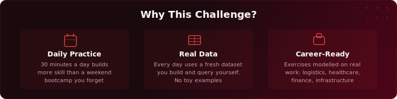

  

  
  

# Why This Challenge?

There are hundreds of SQL courses out there. Free ones, paid ones, 4-hour ones, 40-hour ones. So why this one?

---

## Most SQL courses have the same problem

You watch a video. You nod along. The instructor types a query, you see the result, and it makes sense in the moment. Two weeks later, someone asks you to write a GROUP BY query and you're back on Google.

That's not a you problem. That's a design problem. Watching someone else write SQL doesn't build skill. Writing it yourself does. Every single day, with data you can actually touch, with questions that force you to think - not just copy.

That's what this challenge fixes.

---

## What makes this different

  

### You write SQL every day for 30 days

Not "watch for 30 days." Write. Each day gives you a fresh dataset, a real scenario, and exercises where you have to figure out the query yourself before checking the solution. By Day 10, you stop Googling basic syntax. By Day 20, you're writing multi-step queries without thinking about it. By Day 30, SQL is just something you know.

The research is clear on this: spaced repetition beats massed practice every time. 30 minutes a day for 30 days builds stronger recall than 15 hours in a weekend. Your brain needs sleep between sessions to consolidate what you learnt. This challenge is designed around that.

---

  

### The data is real (not toy examples)

You won't be querying a 5-row `employees` table for 30 days. Each day has a different dataset designed to feel like actual work:

- **Day 2:** Loan applications at a fintech company - credit scores, risk flags, approval decisions
- **Day 7:** Freight shipments with dirty data - mislabelled statuses, duplicates from a system migration
- **Day 12:** School exam results across 4 schools - benchmarking, subqueries, temp tables
- **Day 21:** SaaS trial-to-paid conversion - funnels, cohort analysis, business metrics
- **Day 30:** FinTech lending platform - 14,000+ rows, 6 tables, full capstone

When you land a data role, nothing feels unfamiliar because you've already worked with data that looks like this.

---

  

### Every exercise puts you in a real role

You're not answering "write a SELECT query." You're a junior data analyst whose manager needs numbers before a board meeting. You're a data engineer whose support team lead needs the ticket backlog sorted before standup. You're an analytics engineer building a pipeline for the operations director.

The scenarios are modelled on real work across logistics, finance, education, healthcare, and SaaS. The pressure is realistic. The questions are the kind your manager would actually ask.

This matters because interviews test problem-solving, not syntax recall. If you've spent 30 days solving realistic problems, you walk into an interview with stories to tell.

---

## What you'll walk away with

By the end of 30 days, you'll be able to:

- Write complex queries from scratch without Googling every function
- Clean messy data, handle NULLs, and transform columns confidently
- JOIN multiple tables and understand exactly what each JOIN type does
- Use window functions, CTEs, and subqueries to answer multi-step questions
- Read query plans and make slow queries faster
- Build a complete analytics pipeline from schema design to reporting

More importantly, you'll think differently. SQL teaches you to decompose vague questions into precise, solvable steps. That skill doesn't go away.

---

## What it costs

Nothing. The videos are free. The repo is free. The datasets are free. The solutions are free.

Stephen built this because he believes the best way to learn SQL is daily practice with real data - and that shouldn't be locked behind a paywall. Hundreds of hours went into creating these lessons, datasets, and exercises.

If this challenge helps you - even a little - the best way to say thanks is to [subscribe on YouTube](https://www.youtube.com/@sdw-online?sub_confirmation=1). It takes one click, costs nothing, and it means Stephen can keep making free content like this. More subscribers means the algorithm shows this to more people who need it. That's how we keep the cycle going - free knowledge that actually helps people get into data careers.

  

---

  <a href="where-to-start.md"><strong>Ready? Find your starting point &rarr;</strong></a>

  <a href="../day-01/">Or just jump straight into Day 1</a>

