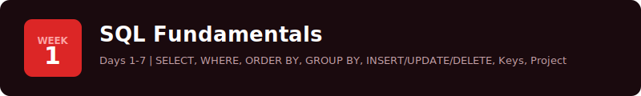

# Week Banner Variants - Pick Your Favourite

All use the crimson/red brand palette. No watermark text, no left accent bar.

---

## Variant 1: Clean Minimal
No decorations, just typography on dark.

---

## Variant 2: Bottom Stripe
Red gradient stripe along the bottom edge.

---

## Variant 3: Top Stripe
Red gradient stripe along the top edge.

---

## Variant 4: Badge Left
Square red badge with week number, text beside it.

---

## Variant 5: Pill Badge
Pill-shaped week label inline with the title.

---

## Variant 6: Gradient Background
Subtle diagonal gradient from dark to deeper red.

---

## Variant 7: Right Badge
Circular week badge on the far right.

---

## Variant 8: Glow Border
Subtle red glow border around the entire banner.

---

## Variant 9: Split Tone
Dark left fading to deeper crimson on the right.

---

## Variant 10: Corner Dots
Decorative dot grid fading in from the top-right corner.

---

**Reply with your pick (e.g. "V4" or "V6 + V10 combined") and I'll generate all 4 week banners in that style.**
