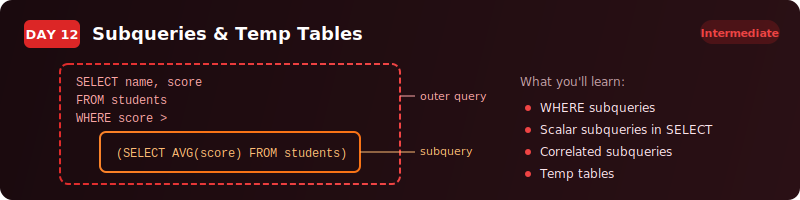

<p align="center">
  
</p>

<p align="center">
  <a href="https://youtu.be/SOt5jUrzKOU"></a>
  
  
  
</p>

# Day 12 - Subqueries & Temp Tables

> Nest one query inside another to answer multi-step questions - then store results for reuse.

[<< Day 11: CASE WHEN](../day-11/) | [Day 13: CTEs (Part 1) >>](../day-13/)

---

## What You'll Learn

- Subquery patterns in WHERE (comparison operators, `IN`)
- Scalar subqueries in SELECT for benchmark columns
- Correlated subqueries that reference the outer query row by row
- Derived tables in FROM for multi-step calculations
- Temporary tables for storing and reusing intermediate results

---

## Quick Setup

```sql
-- Run in pgAdmin (takes ~5 seconds)
\i setup.sql
```

Or open [`setup.sql`](setup.sql) and run the full script manually.

**Teaching data:** `grocery_purchases` - 25 purchases across 6 categories, 4 stores, 5 shoppers.
**Exercise data:** `school_results` - 30 exam records from 4 schools, 4 subjects, grades 7-11.

<details>
<summary>Verify your setup</summary>

```sql
SELECT COUNT(*) FROM grocery_purchases;  -- 25 rows
SELECT COUNT(*) FROM school_results;     -- 30 rows
```

</details>

---

## Exercises

You work at a regional education authority. The Head of School Performance needs a benchmarking report comparing student scores against school and national averages.

Using the `school_results` table:

### Task 1: Above-Average Students

Find all students who scored above the overall average. Show student name, school, subject, and score (sorted by score descending).

<details>
<summary>Hint</summary>

Use a subquery in `WHERE` with `AVG(score)` as the threshold.

</details>

### Task 2: School Average vs Student Score

Show each student's score alongside their school's average. Add a column for the difference. Sort by school, then score descending.

<details>
<summary>Hint</summary>

Use a correlated subquery in `SELECT` that filters by the outer query's `school_name`.

</details>

### Task 3: Underperforming Schools

Find schools whose average score is below the national average. Show school name and average score.

<details>
<summary>Hint</summary>

Wrap a `GROUP BY` query as a derived table in `FROM`, then filter with `HAVING` or a subquery.

</details>

### Task 4: Temp Table Report

Create a temp table storing each school's average score, student count, and highest score. Query it to add a performance rating: "Strong" (80+), "Average" (60+), "Needs Support" (below 60).

<details>
<summary>Hint</summary>

`CREATE TEMP TABLE school_summary AS SELECT ...` then query `school_summary` with `CASE WHEN`.

</details>

### Solutions

Finished? Check your answers: [`solutions.sql`](solutions.sql)

---

## Key Concepts

| Concept | What It Does |
|---------|-------------|
| **Subquery in WHERE** | Dynamic threshold instead of hardcoded values |
| **Scalar subquery in SELECT** | Adds a calculated benchmark column to every row |
| **Correlated subquery** | References the outer query for row-specific values |
| **Derived table in FROM** | Wraps a subquery as a virtual table (always needs an alias) |
| **Temp table** | Calculate once, reuse many times - disappears when you disconnect |
| **CREATE TEMP TABLE AS** | Create + populate in one step |

---

## Where To Next?

<p align="center">
  
</p>

---

<p align="center">
  <a href="../day-11/">&#9664; Day 11: CASE WHEN</a> &nbsp;&nbsp;|&nbsp;&nbsp; <a href="../day-13/">Day 13: CTEs (Part 1) &#9654;</a>
</p>
