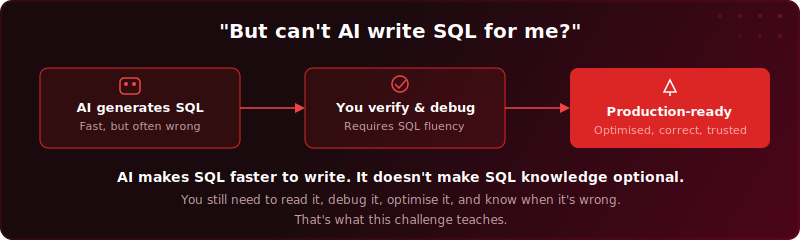
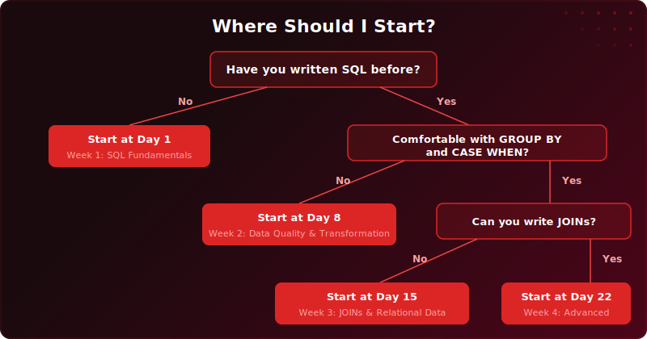
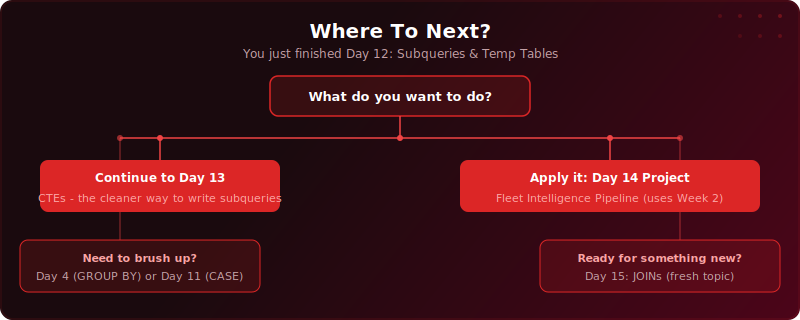

# New Sections Preview

All new SVGs for the redesigned README. Review each and let me know what to adjust.

---

## 1. "Why This Challenge?" (goes after How It Works)

3-column layout: Daily Practice, Real Data, Career-Ready.

---

## 2. "SQL in the AI Era" (goes after Why This Challenge)

Visual flow: AI generates > You verify > Production-ready. Addresses the "AI can do it" objection head-on.

---

## 3. "Where Should I Start?" Decision Tree (goes before Curriculum)

Routes all experience levels to the right starting point. Not just for beginners.

---

## 4. Per-Day "Where To Next?" (goes at the bottom of each day README)

Example shown for Day 12. Each day gets a customised version linking to relevant next steps.

---

**Proposed main README order:**

1. Hero image + badges
2. How It Works
3. Why This Challenge? (NEW)
4. SQL in the AI Era (NEW)
5. Where Should I Start? decision tree (NEW)
6. Curriculum (4 week banners + tables)
7. Quick Start
8. What People Are Saying
9. Other Installation Guides
10. About
